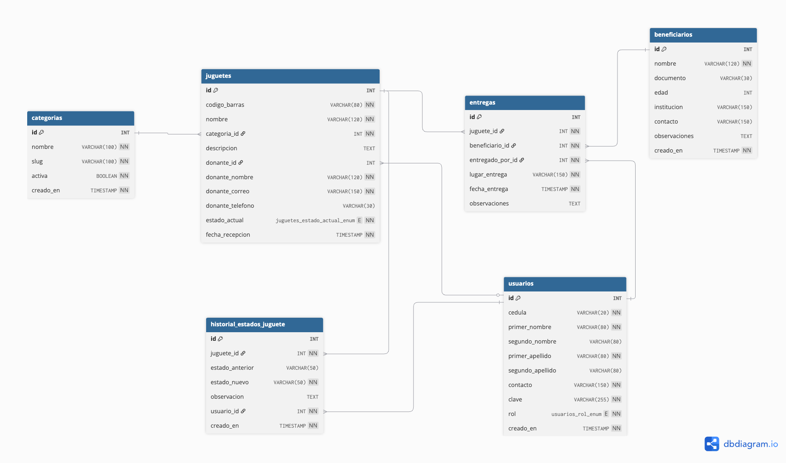

# 🧸 Clínica de Juguetes UCC

Sistema de gestión para la Clínica de Juguetes de la Universidad Cooperativa de Colombia.

Permite registrar juguetes donados, gestionar su proceso de reparación, controlar estados, trazabilidad y entrega a beneficiarios.

---

## 🚀 Tecnologías

- Python 3
- Flask
- MySQL 8
- Docker
- HTML/CSS
- Jinja2

---

## 📦 Requisitos

- Python 3.11+
- Docker Desktop
- Git

---

## ⚙️ Instalación

Clonar repositorio:

```bash
git clone URL_DEL_REPO
cd Clinica-Juguetess/Humantech
```

Crear entorno virtual:

```bash
python -m venv .venv
```

Activar entorno:
Mac/Linux:

```bash
source .venv/bin/activate
```

Windows:

```bash
.venv\Scripts\activate
```

Instalar dependencias:

```bash
pip install -r src/requirements.txt
```

## 🐬 Base de datos

Levantar MySQL con Docker:

```bash
docker run -d \
  --name clinica-mysql \
  -e MYSQL_ROOT_PASSWORD=123456789 \
  -e MYSQL_DATABASE=clinica_juguetes \
  -p 3306:3306 \
  mysql:8.0
```

Importar base de datos:

```bash
docker exec -i clinica-mysql mysql -uroot -p123456789 clinica_juguetes < database/clinica_juguetes.sql
```

#### Schema de la BD



### ▶️ Ejecución rápida

```bash
./bin/run
```

La aplicación quedará disponible en:

```bash
http://localhost:5001
```

### 👤 Usuario administrador de prueba

```bash
Correo: admin@clinica.com
Password: tester
```

### 📚 Funcionalidades

- Registro de juguetes
- Gestión de categorías
- Trazabilidad de estados
- Entrega a beneficiarios
- Historial completo
- Filtros
- Paginación
- Gestión de donantes
- Código de barras

### 🧩 Estados del juguete

- Registrado
- En revisión
- En reparación
- Reparado
- Listo para entrega
- Entregado
- Descartado

### 🗂️ Estructura del proyecto

```bash
src/
├── routes/
├── helpers/
├── static/
├── templates/
├── config/
└── app.py
```

### 👨‍💻 Autores

Proyecto académico — Universidad Cooperativa de Colombia

---
